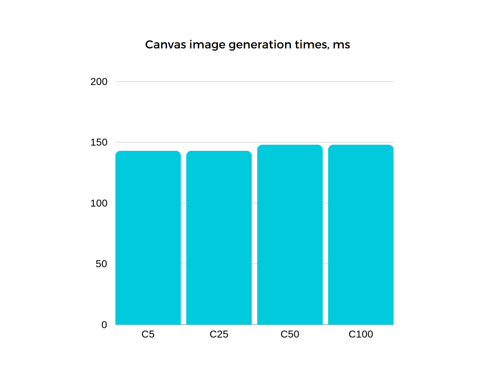
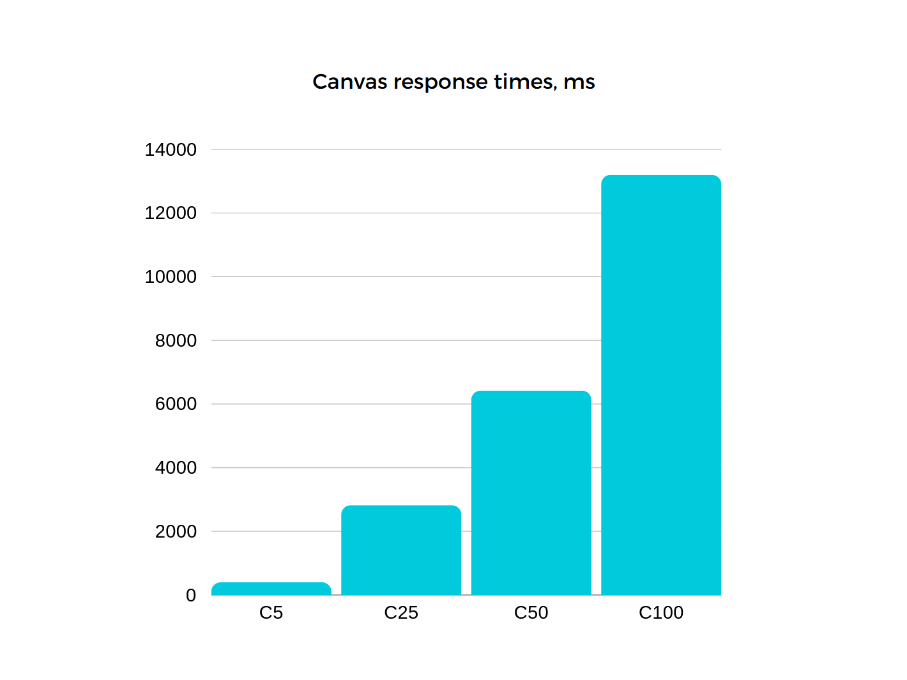
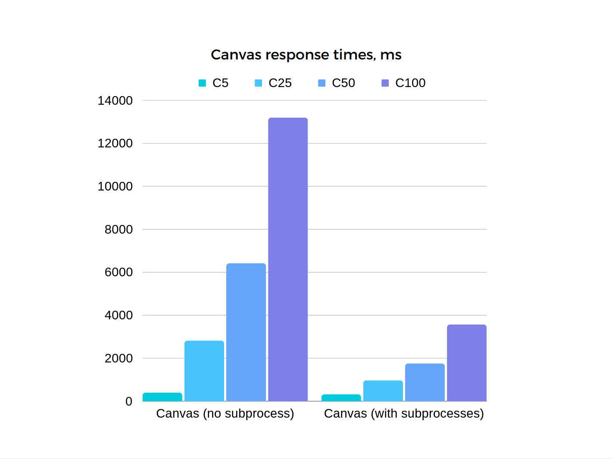
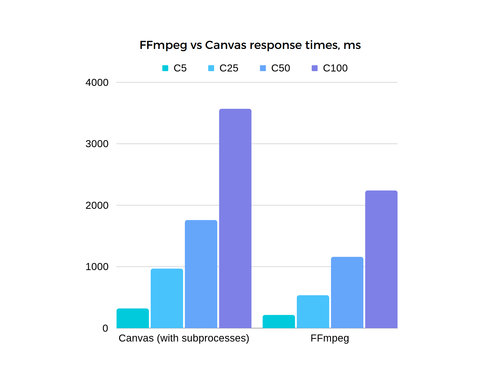

When I was working on the original version of [Zephyr](https://zephyr.bot/), a K-pop trading card game on Discord, around early 2021, a frequent pain point for me was the speed of the image generator, which ran on Canvas. During updates, the bot would simply not be able to handle the massive influx of players trying to drop cards and would slow to a crawl. Eventually, it became so overwhelming that I decided to shut the project down. So, with the blessing of hindsight, let's figure out what went wrong and how to fix it.

# What is Canvas?

If you're not familiar, the Canvas API is a way to render 2D graphics in your browser with JavaScript. It's used for animations, games, graphs, image manipulation, and much more. However, its usage isn't just limited to the browser thanks to an [implementation](https://github.com/Automattic/node-canvas) in Node. It's fast enough, and it's the most beginner-friendly image manipulation tool in JavaScript, so it's what I used and it's what many other newbie developers continue to use today.

The most common images generated in Zephyr are drops. These images are simply three pre-generated cards lined up next to each other. It sounds simple enough, right? Let's see some code:

```js
const canvas = createCanvas(385 * 3, 550);
const ctx = canvas.getContext("2d");

const card1 = await loadImage("src/assets/card1.png");
const card2 = await loadImage("src/assets/card2.png");
const card3 = await loadImage("src/assets/card3.png");

ctx.drawImage(card1, 385 * 0, 0, 385, 550);
ctx.drawImage(card2, 385 * 1, 0, 385, 550);
ctx.drawImage(card3, 385 * 2, 0, 385, 550);

writeFile("output.png", canvas.toBuffer());
```

Pretty easy. This is what one such drop might look like:


This operation will be our bread and butter for this article. I'm sure by this point you want to see some benchmarks. To benchmark this function, we will use an [express](https://expressjs.com/) server with an endpoint for our function. We will also be using [Siege](https://github.com/JoeDog/siege), a powerful load tester which can more closely mimic how requests are sent from real users. To start, let's check the average image generation time for 5/25/50/100-user concurrencies.

```bash
siege 'http://localhost:7272/canvas' -v -r 5 -c100 -d1
```

The `-c` flag specifies the number of concurrent "users" that will be sending requests. Each user will send five `-r`equests, adding up to 500 requests in total. Let's see how we do...

# Hitting the bench



Hey, 140ms is pretty good! Looks like it can keep up just fine with heavy loads, right? Well... no. This graph does look good, but we also need to consider our request response time to get the full picture.



It is now apparent that Canvas, in fact, cannot keep up at all. Keeping our users waiting this long is a recipe for disaster, so how can we fix it? Let's take a step back for a moment and figure out _why_ this is happening in the first place.

It is widely known that JavaScript is a single-threaded language, meaning that we are not able to execute operations in parallel. Since image manipulation is computationally expensive, and we're doing it a LOT, Canvas is pretty much always going to be blocking the Node.js event loop when it's active, preventing other code from running, in turn preventing us from running more Canvas operations alongside the first one. Our requests are effectively going through one singular first-in first-out queue, which is very bad when requests pile up faster than you can fulfill them.

Thankfully, despite JavaScript's single-threaded nature, it is actually possible to get concurrent Canvas operations to run on multiple threads. We can accomplish this by leveraging [child processes](https://nodejs.org/api/child_process.html). We can invoke the command line and spawn subprocesses to execute anything - even code that isn't JavaScript. Let's move our Canvas code into a separate file and spawn a subprocess whenever Express receives a request.

```js
app.get("/canvas", async (_, res) => {
  const child = spawn("node", ["./src/canvas_child.js"]);

  child.on("close", () => {
    res.status(204).send();
  });
});
```

Now, a new subprocess will be spawned to do the Canvas work for each request, and Canvas will no longer be blocking the main event loop which will allow us to spawn even more subprocesses! Let's run the same benchmarks and see if anything's changed.



Wow, that's a pretty major improvement! We're seeing almost a 4x speedup under load. Great! Canvas can now leverage our CPU to a much better degree than before, and our users are much happier. Our servers, and wallet, will be happier too - this change could allow us to scale vertically in the future! For smaller-scale projects, this simple optimization will likely be enough to escape the clutches of downtime, but surely there must be something more blazing-fast than plain old JavaScript?

# The backbone of the internet

Enter [FFmpeg](https://ffmpeg.org/). The Swiss Army knife of video and audio. If you've ever interacted with video on the internet before, chances are [FFmpeg is behind it](https://twitter.com/FFmpeg/status/1710440696941809868), and the team does not play around. Most of FFmpeg consists of [hand-optimized assembly code](https://twitter.com/FFmpeg/status/1705540562747593003), if that's any indication of how seriously its development is taken. This sounds like an exciting prospect, so what can it do for us?

Well, unfortunately, it's not going to get us into the microseconds. FFmpeg really shines with its ridiculously comprehensive system of filters, but most of them are not going to be useful to us right now. We will set our sights on the `hstack` - horizontal stack - filter, which is all we need. Here's what our command is going to look like:

```bash
ffmpeg
    -i ./src/assets/card1.png
    -i ./src/assets/card2.png
    -i ./src/assets/card3.png
    -filter_complex hstack=inputs=3
    -f image2
    -codec png
    pipe:1
```

All you need to know about this command is that the first three arguments are specifying our input images, and the filter complex is describing how our inputs should be arranged. Let's spawn some more child processes and see how this tool stacks up to Canvas.



The graph needs little explanation. FFmpeg blows Canvas out of the water here. If you're looking to squeeze every drop of performance you can get out of your image generator, this will get you there, and it will probably end up saving you money. Not only is it faster by _yet another_ 1.5x, it demands less of your CPU along the way.

This is to say nothing of the rest of FFmpeg's filter library - Zephyr 2.0's [image generator](https://github.com/mittens-cc/zephyr-images) runs entirely on FFmpeg and builds cards from scratch, with support for frames, stickers, and luminance-aware dyes. If you run one of these card bots and you work with non-static images, you should seriously consider using FFmpeg if you aren't already - your players and servers will thank you.

# Post-optimization musings

EXPLAIN **WHY** FFMPEG IS FASTER (MULTITHREADING)
